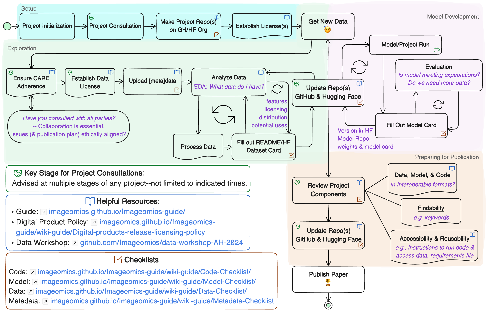

# Digital Product Life Cycle

The Imageomics Institute is committed to FAIR and Reproducible data, software, ML models, and computational workflows, as demonstrated and defined by the [Digital Products Release and Licensing Policy](Digital-products-release-licensing-policy.md) that the Institute adopted. To achieve full and consistent adherence to this policy, promote integration of requisite best practices into the research project lifecycle, and to ensure the limited data science support resources of the Institute for assistance are utilized efficiently, the Digital Product Life Cycle aims to establish a life cycle framework with designated, regular, interspersed points at which research project teams are expected to engage with the Institute’s data science support team about digital artifacts and practices supporting adherence to our digital product commitments.

Although most of the engagement from the side of research teams is expected to (and arguably should) primarily involve NextGens, responsibility for awareness of this policy and a team’s commitment to follow it lies with project[^1] PI(s). By following these guidelines, it will be easier to meet these requirements before paper submission deadlines without requiring major revisions on a truncated schedule (i.e., most—if not all—of the FAIR requirements will have been resolved prior to conference submissions). Below is a project life cycle diagram outlining the expected process of this policy, followed by an enumeration of the expectations organized by development phase.

**Figure 1:** _Visual representation of the AI/ML project life cycle underpinning this policy. After the Setup phase, both Exploration and Model Development are ongoing iterative processes that build to the ultimate goal of a published paper, following Publication Preparation where the work of the previous iterative phases is reviewed and polished for **F**indability, **A**ccessibility **I**nteroperability, **R**eusability (FAIR) and Reproducibility. Key Stages for Project Consultations are highlighted, along with Helpful Resources to guide work at each stage and checklists to ensure FAIR and Reproducibility are always in mind._

## Responsibilities and Actions

The following adds additional context and direction to supplement the diagram, organized by project lifecycle stage.

### Setup Phase:

* NextGens and/or project[^1] PIs schedule a project consultation with the Senior Data Scientist. This will include scope and intended data usage for improved research convergence and to ensure projects start with all available resources in mind.
* In GitHub project repo, create an issue for each of the repositories for the digital products with the appropriate checklist:
  * **Code and workflows:** GitHub Repository ([Code checklist](Code-Checklist.md)).
  * **Datasets:** Hugging Face Dataset Repository ([Data checklist](Data-Checklist.md)).
    * For already published data usage, see the [Metadata Checklist](Metadata-Checklist.md).
  * **ML Models:** Hugging Face Model Repository ([Model checklist](Model-Checklist.md)).

### Exploration Phase:

* Maintain record of any and all data utilized (source, license, citation, etc.).
  * See [Data Sources Template](https://docs.google.com/spreadsheets/d/1r4-_Ytg2bwGMxLpYrk4GVhx61JSOYXANsSFjryNmsDE/edit?usp=drive_link).
* Document exploration of data.
  * This establishes an understanding of what the data is and how it can be used. For an example and guidance, consider the exploration and documentation done in the [Data Workshop](https://github.com/Imageomics/data-workshop-AH-2024).
* Record processing steps applied—maintained in a well-documented code repository (following [GitHub Guidance](GitHub-Repo-Guide.md))—and update Dataset Card(s) with information and links back to GitHub repository.
* Establish and update contributor list—follow the [Imageomics Author Guide](https://docs.google.com/spreadsheets/d/1GwlCukfoQPL8JI2yyWRD3g4uiMTO3tlGNE_qeb_xBCs/edit?usp=sharing).[^2]
  * Authors and author order for the paper and codebase (and/or dataset) may differ, all should be discussed.

### Model Development Phase:

* Maintain a record of any and all base models utilized (source, license, citation, etc.).
* Record model experiments—scripts or Jupyter Notebooks, _documented_[^3] and maintained in GitHub for version control as different approaches are tried.
* Document model experiments and evaluation—record results of various tests performed and overall evaluation and comparison of these runs in Model Card(s) with links back to GitHub repository.
* Add all code used to generate figures to the project GitHub repository; including documentation for reproduction (e.g., package requirements, data info, instructions).
* Review (and revise as necessary) the Author/Contributor list(s).

### Preparing for Publication:

* Project components should align with FAIR and Reproducibility principles:
  * Completed and fully documented GitHub Repository for code (recall [Code checklist](Code-Checklist.md)).
  * Completed and fully documented Hugging Face Dataset Repository for data products (recall [Data checklist](Data-Checklist.md)).
    * If using an already published dataset, all requisite metadata and provenance information included (recall [Metadata checklist](Metadata-Checklist.md)). Specifically, ensure that all attribution requirements and/or expectations have been appropriately met.
  * Completed and fully documented Hugging Face Model Repository for ML models (recall [Model checklist](Model-Checklist.md)).
* Schedule Review by Senior Data Scientist of data, model, and code repositories 3 weeks prior to camera-ready deadline (approval required for DOI generation).
* Review (and revise as necessary) the Author/Contributor list(s).

[^1]:  Here we use the term project at a smaller scale to mean any endeavor resulting in a digital product (dataset, ML model, code) and/or paper (e.g., for the purposes of this policy [SST](https://github.com/Imageomics/SST) is a *project*, while Butterflies is not).

[^2]:  Contributor lists should be started as early as possible and are subject to change as a project progresses; this is expected and the reason to review during each phase of development.

[^3]:  Notebooks allow for Markdown explanations and descriptions throughout your process and the demonstration of results without requiring others to run your code.
