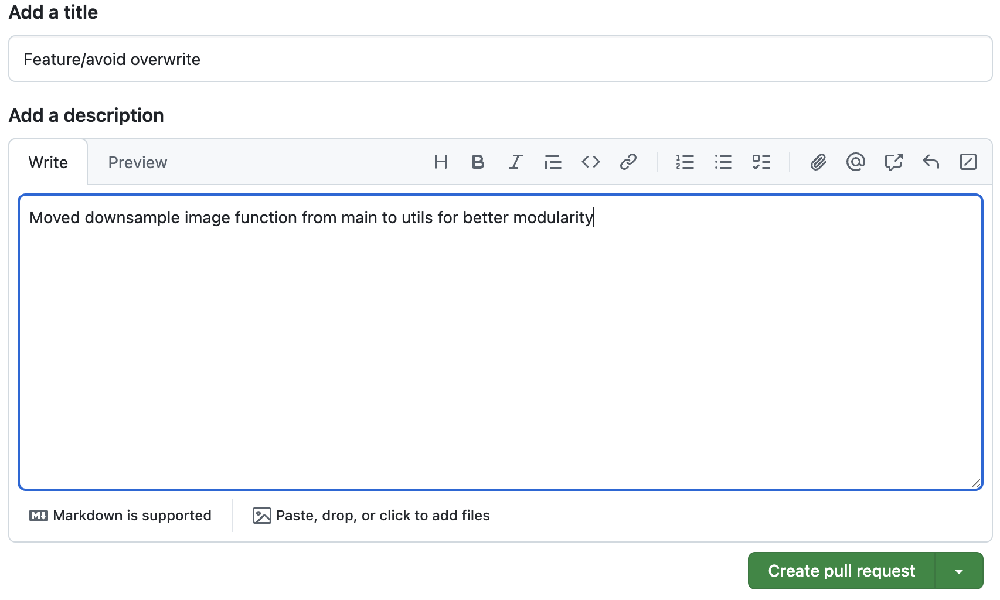
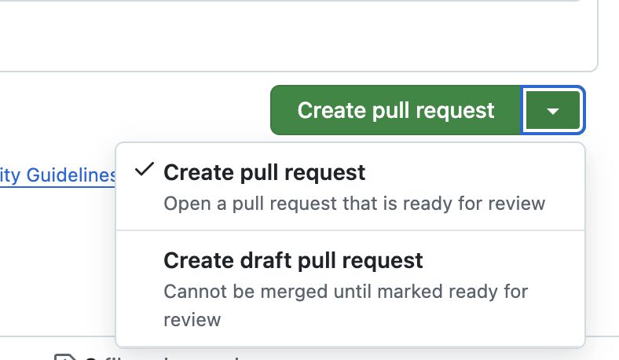
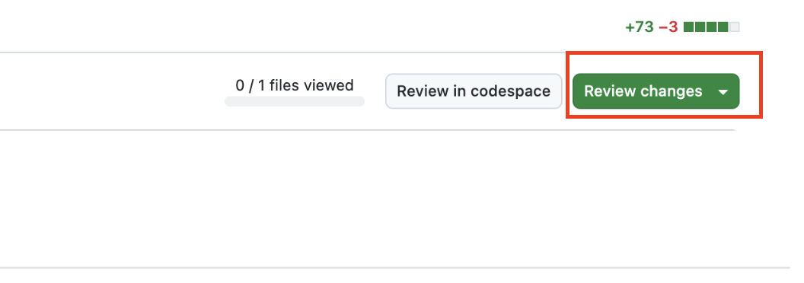
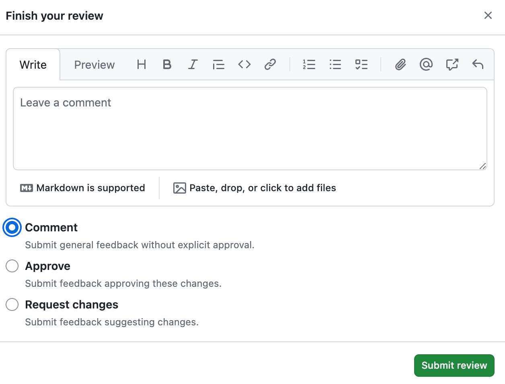

# **GitHub Pull Request (PR) Guide Overview**

This guide is divided into three essential sections to help you effectively manage pull requests in a collaborative project:

- [Creating a Pull Request](#1-creating-a-pull-request): This section explains how to properly prepare and submit a pull request (PR) to ensure that your changes are well-documented, easy to review, and aligned with project goals.
- [Reviewing a Pull Request](#2-reviewing-a-pull-request): Learn the best practices for providing constructive feedback, identifying potential issues, and ensuring code quality during the review process.
- [Responding to a Pull Request Review](#3-responding-to-a-pull-request-review): Understand how to address reviewer feedback, make necessary changes, and ensure your pull request meets the required standards for approval.

By following these steps, you will contribute to a smooth and efficient workflow, ensuring collaboration and quality in your project. 

## **1. Create a Pull Request**
Before creating a pull request, first, please follow [2.1. The GitHub Workflow](The-GitHub-Workflow.md) to create and push your Branch. 

### 1.1 Navigate to the Repository's Main Page
On GitHub, go to the main page of the repository where you’ve pushed your branch.

### 1.2 Select Your Branch
From the "Branch" menu, choose the branch that contains your changes (the one you just pushed).

### 1.3 Click 'Compare & pull request'
You’ll see a button labeled Compare & pull request. Click this to begin the process of creating a pull request for your changes.

{ loading=lazy, width="800" }
/// caption
///

### 1.4 Add Title and Description
In the pull request form, type a descriptive title for your PR. Provide a detailed description of the changes you've made, why they are important, and any other relevant information.

{ loading=lazy, width="800" }

### 1.5 Choose Review Type

- If your pull request is ready for review, click Create Pull Request.
- If you want to create a draft version of the pull request for further work before it's ready for others to review, click the drop-down and select Create Draft Pull Request, then click Draft Pull Request.

{ loading=lazy, width="350" }
/// caption
///

## **2. Reviewing a Pull Request**

### 2.1 Navigate to the **Pull requests** tab

{ loading=lazy, width="800" }
/// caption
///

### 2.2 Select a Pull Request

In the list of pull requests, click the pull request that you'd like to review. 

{ loading=lazy, width="800" }
/// caption
///

### 2.3 Review Changes
In the pull request page, click **Files changed** so as to see the changes.

{ loading=lazy, width="600" }
/// caption
///

2.3.1 by clicking { loading=laze, width="20"}, you can choose the unified or split view. 

{ loading=lazy, width="600" }
/// caption
///

### 2.4 Add Comments or Suggestions
When hovering over the lines of code, you can click the blue comment icon to add your review comments.

{ loading=lazy, width="800" }
/// caption
///

2.4.1 If you'd like to add a comment on multiple lines, please click the line number of the first line you want to add comments and drag down to select a range of lines. 

### 2.5 Suggest Changes
If you'd like to suggest a specific change to the lines, click { loading=lazy, width="20"}, and then edit the text within the suggestion block. 

{ loading=lazy, width="600" }
/// caption
///

### 2.6 Comment on a File
If you'd like to comment on a file, click { loading=lazy, width="20"} at the right top of the file, then add your comments.

{ loading=lazy, width="500" }
/// caption
///

### 2.7 Mark Files as Viewed
After you finished reviewing a file, you can mark it as viewed. 

{ loading=lazy, width="600" }
/// caption
///

### 2.8 Start or Add to a Review
When you're done, click Start a review. If you have already started a review, please click Add review comment.
!!! note "Notice"
    All line comments are pending and only visible to you. You can edit the comments when needed. If you'd like to abandon your review, please go to in **Review changes** and click **Abandon review**

### 2.9 Review and Summarize Proposed Changes

Click Review changes, and then type comments to summarize your proposed changes.

{ loading=lazy, width="500" }
/// caption
///

### 2.10 Select Review Type

{ loading=lazy, width="600" }
/// caption
///

- Select Comment: Provide general feedback on the changes without explicitly approving or rejecting them.
- Select Approve: Indicate that you’ve reviewed the changes and approve them for merging. A common comment for simple approvals is "LGTM" (Looks Good to Me).
- Select Request changes: Provide feedback indicating that revisions are needed before the changes can be approved.

### 2.11 Click Submit review
Current review round is done; this publishes your comments and suggestions. Then the PR can either be merged or updated (depending on approval or comments). We generally expect that whoever submits the PR will merge once all feedback has been incorporated or otherwise addressed.

## **3. Responding to a Pull Request Review**

### 3.1 Navigate to the Repository's Main Page
Navigate to your repository name, click **Pull requests**

{ loading=lazy, width="600" }
/// caption
///

### 3.2 Incorporate Feedback Changes

After receiving feedback on your pull request, you can apply the changes in one of two ways: either by committing each change individually or by grouping several changes into a single commit. The method you choose depends on whether you prefer fine-grained control over the commit history or a more streamlined approach.

#### 3.2.1 Apply a change in its own commit
If you agree with at suggested change, qpply it by creating a separate commit for it. This approach helps keep your commit history clear and each change traceable.

{ loading=lazy, width="600" }
/// caption
///

#### 3.2.2 Add multiple suggestions to a batch of changes
If you plan to include multiple changes in one commit, you can add suggestions to a batch. Once you've collected all the desired suggestions, click "Commit suggestions" to apply them in one go.

{ loading=lazy, width="600" }
/// caption
///

### 3.3 Add Commit Message
In the commit message field, enter a brief, descriptive message that clearly explains the changes made to the file(s).

### 3.4 Click Commit changes
After entering your commit message, click the "Commit changes" button to finalize and save your modifications to the repository. This step ensures that your changes are recorded and can be reviewed or merged into the main codebase.

### 3.5 Re-requesting a Review
If you’ve addressed all the requested changes and your pull request requires further review, re-request a review by notifying the reviewers. This action prompts them to evaluate your updated code and provide feedback or approval.

### 3.6 Out-of-scope Suggestion
If the suggested change falls outside the scope of your pull request, create a new issue to address the feedback separately. Issues can be created directly from a PR comment.
