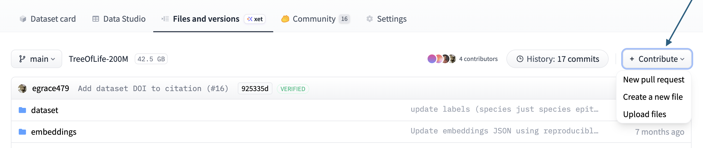

# Hugging Face Dataset Guide

[Hugging Face](https://hf.co/) offers numerous methods for interacting with and creating datasets. This page provides a basic overview with some recommendations specifically targeting image dataset uploads, though the principles are transferrable to other data types. We list these options&mdash;in order of increasing complexity&mdash;with some guidance, recommendations, and links out to the appropriate parts of the Hugging Face docs for the most up-to-date information available.

1. [Web interface (UI)](#upload-a-dataset-with-the-web-interface): For smaller, simpler uploads.
2. [Hugging Face Command Line Interface (CLI)](#upload-a-dataset-with-the-hugging-face-cli): For most use-cases, easy access from cluster.
3. [Hugging Face API (python package)](#upload-a-dataset-with-hfapi): For when more fine-grained control than is achievable with the CLI is needed.
4. [Git/Git LFS](#upload-a-dataset-with-git): Main use-case is when multiple PRs lead to merge conflicts&mdash;Hugging Face provides no other means for resolution.

!!! info
    Some sections of the Hugging Face docs, such as for the `huggingface_hub`, have only version specific links for stable versions. In this case, if the link directs to an older version, there will be a banner to alert you to a newer version available, so keep an eye out for that updated version banner.

Most of the content below is covered in various parts of [Hugging Face's Upload Guide](https://huggingface.co/docs/huggingface_hub/en/guides/upload); this page is provided as a summary reference mainly to determine which method might be best and link to the appropriate docs. Additionally, we include an [integrity check](#integrity-check) to help you ensure that your repo contains all the desired files after uploading through any of these methods.

[HF tips and tricks for large uploads](https://huggingface.co/docs/huggingface_hub/en/guides/upload#tips-and-tricks-for-large-uploads).

## Note on Authentication

All of these methods require authentication to edit datasets, ranging from passwords, to tokens, to SSH authentication, and all support editing **Public** (accessible to anyone on the internet) or **Private** (accessible only to members of the organization) repos. Two key notes on authentication:

1. Private repositories are only visible if you are authenticated.
2. If using tokens for access, be sure to create a [fine-grained token](https://huggingface.co/docs/hub/en/security-tokens#what-are-user-access-tokens), specifically for your needs.

## Upload a Dataset with the Web Interface

In the Files and Versions tab of the repository, you can select "Contribute" to add or create files or start a pull request directly from the web interface.

{ loading=lazy }

This method is fine for smaller files (<100MB), or data uploads from distributed sources, that have a relatively flat structure with few directories, and/or have few files. If you are uploading existing files, navigate to the target folder first.

## Upload a Dataset with the Hugging Face CLI

Hugging Face provides a comprehensive Command Line Interface (CLI) and corresponding [docs](https://huggingface.co/docs/huggingface_hub/en/guides/cli). Note that this is installed with the `huggingface_hub` python package, but can also be installed directly, then called with `hf <command>`.

The Hugging Face CLI is the ideal method for uploads that are large in volume, have more than a few files, and/or a folder structure with many or nested directories. It works directly from HPC clusters, such as OSC. Under the hood, [`hf upload`](https://huggingface.co/docs/huggingface_hub/en/guides/cli#hf-upload) uses the same upload functions described below, under [Upload a Dataset with HfApi](#upload-a-dataset-with-hfapi). Review [Hugging Face's guidance on large folder uploads](https://huggingface.co/docs/huggingface_hub/v1.10.1/guides/upload#upload-a-large-folder) before selecting a method for uploading large folders to a non-empty repository.

When uploading to a dataset, note that the repo type must be specified (`--repo-type=dataset`); this is also the case for spaces, since Hugging Face treats models as the default.

There are specific [`hf datasets`](https://huggingface.co/docs/huggingface_hub/en/guides/cli#hf-datasets) and [`hf repo`](https://huggingface.co/docs/huggingface_hub/en/guides/cli#hf-repo) commands for more general queries and repo initialization.

## Upload a Dataset with HfApi

When more complex dataset structures are involved or more fine-grained control (not exposed on CLI) over how a repo will be organized on Hugging Face is neeeded, the Hugging Face API may be the answer. For instance, if a glob pattern cannot sufficiently clarify necessary exclusions of subfolders or files, [`HfApi`](https://huggingface.co/docs/huggingface_hub/package_reference/hf_api) is likely the preferred choice. This is a class, accessible through the [`huggingface_hub` package](https://huggingface.co/docs/huggingface_hub/index), that acts as a Python wrapper for the API.

Please see the Hugging Face API docs for the most up-to-date guidance. For quick reference, to [upload by file](https://huggingface.co/docs/huggingface_hub/v1.10.1/package_reference/hf_api#huggingface_hub.HfApi.upload_file) or [upload by folder (structure maintained)](https://huggingface.co/docs/huggingface_hub/v1.10.1/package_reference/hf_api#huggingface_hub.HfApi.upload_folder).

``` py linenums="1"
from huggingface_hub import login

# Login with your personal token (find your tokens at: Settings/Access Tokens)
login()

from huggingface_hub import HfApi
api = HfApi()
repo_id = "<ABC-Center/dataset name>"

# Upload by file
api.upload_file(
    path_or_fileobj = <the local file path that you would like to upload>,
    path_in_repo = <the path in the repo>,
    repo_id = repo_id,
    repo_type = 'dataset'
)

# Upload by folder (maintain structure)
api.upload_folder(
    folder_path="/path/to/local/folder", # should end with folder containing data
    path_in_repo="path/to/folder/", # path desired for folder in repo
    repo_id= repo_id,
    repo_type="dataset",
    token_id = "paste-token-here" # if you're not logged in, HF does **not** recommend this method
)
```

Repos can also be created through the Hugging Face API using the [create_repo method](https://huggingface.co/docs/huggingface_hub/v1.10.1/en/package_reference/hf_api#huggingface_hub.HfApi.create_repo) with the following parameters:

```py linenums="1"
repo_id = "<HF-Org-name>/<dataset-name>"
repo_type = "dataset"
private = True  # if you want the repo private
```

See also instructions using the [datasets package](https://huggingface.co/docs/datasets/create_dataset).

## Upload a Dataset with Git

Using Git to interact with Hugging Face requires installation of [Git LFS](https://git-lfs.com/), the [Hugging Face CLI](https://huggingface.co/docs/huggingface_hub/en/guides/cli), and then enabling large file upload for the repo

Hugging Face provides details on [git vs http](https://huggingface.co/docs/huggingface_hub/en/concepts/git_vs_http), really using Git vs HfApi

Hugging Face has moved away from Git LFS, instead utilizing [Xet](https://huggingface.co/docs/hub/en/xet/index) for data storage and version control; this is [backwards compatible with LFS](https://huggingface.co/docs/hub/en/xet/legacy-git-lfs).

## Other Repo Considerations

One time where `git` may be needed, is if one encounters a [merge conflict](https://discuss.huggingface.co/t/how-to-fix-merge-conflicts-in-prs/160090). Unlike GitHub, Hugging Face ***does not*** have conflict resolution UI tools, nor does it provide merge conflict resolution capabilities in the CLI or HfApi. The only means for resolving merge conflicts is to manually update the pull request in a [local clone](The-Hugging-Face-Workflow.md#hugging-face-pull-requests-with-local-edits), pulling `main` into your PR branch and resolving the conflicts.

## Integrity Check

Sometimes uploads fail partway through, leaving one or more files un-uploaded. Unfortunately, it seems that there is not an easy solution to be alerted to these issues when not uploading through the UI. Additionally, using a glob pattern to set upload without a dry-run[^1] (in `git` terms, this would be running `git status` after adding files) can also lead to accidental exclusion. To catch these issues, we recommend the following integrity check after uploading a dataset[^1].

[^1]: The Hugging Face CLI does have a [dry-run mode](https://huggingface.co/docs/huggingface_hub/en/guides/cli#dry-run-mode) for *downloading* datasets. Additionally, if working with Git LFS, there is a [preupload LFS](https://huggingface.co/docs/huggingface_hub/en/guides/upload#preupload-lfs-files-before-commit) option to ensure all files are properly preset and organized before committing. There are additional considerations for sharding noted in the Hugging Face docs.

```python
import pandas as pd
from huggingface_hub import HfApi

api = HfApi()
repo_id = "<org-name>/<repo-name>"
repo_type = "dataset"

file_list = api.list_repo_files(repo_id=repo_id, repo_type=repo_type)
file_df = pd.Dataframe(columns = {"filepath": file_list})
metadata = pd.read_csv("path/to/metadata/file")

# assuming you use the same filepath in your system as in the repo
df = pd.merge(file_df, metadata, how = "inner", on = "filepath")
df.shape[0]  # this should match the number of expected images
```

!!! tip "Pro tip"
    If you don't have a metadata file for your images, use the [sum-buddy package](Helpful-Tools-for-your-Workflow.md#sum-buddy) to generate one in your local file system. This can also be used as a metadata file for the dataset viewer as needed (see [image datasets docs](https://huggingface.co/docs/hub/en/datasets-image) for more information on setting this up). Similar options are available for [audio](https://huggingface.co/docs/hub/en/datasets-audio) and [video](https://huggingface.co/docs/hub/en/datasets-video) datasets.
