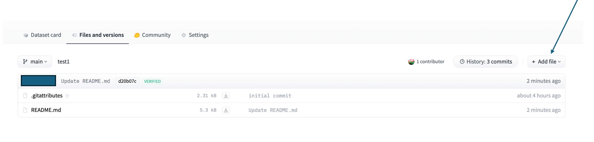

# Hugging Face Dataset Guide

## Create a New Dataset Repository

When creating a new dataset repository, you can make the dataset **Public** (accessible to anyone on the internet) or **Private** (accessible only to members of the organization).

{ loading=lazy, width=800 }
/// caption
///

## Upload a Dataset with the Web Interface

In the Files and versions tab of the Dataset card, you can choose to add file in the hugging web interface.

{ loading=lazy }

## Upload a Dataset with HfApi

``` py linenums="1"
from huggingface_hub import login

# Login with your personal token (find your tokens at: Settings/Access Tokens)
login()

from huggingface_hub import HfApi
api = HfApi()

api.upload_file (
    path_or_fileobj = <the local file path that you would like to upload>,
    path_in_repo = <the path in the repo>,
    repo_id = <ABC-Center/dataset name>,
    repo_type = 'dataset'
)
```

## Upload a Dataset with Git

### If the Dataset is Less Than 5GB

Navigate to the folder for the repository:

```
# Clone the repository
git clone https://huggingface.co/datasets/username/repo-name

# Add, commit, and push the files
git add
git commit -m 'comments'
git push

```

### If the Dataset is Larger Than 5GB

#### Install Git LFS

Follow instructions at <https://git-lfs.com/>

#### Install the Hugging Face CLI

```
brew install huggingface-cli
pip install -U "huggingface_hub[cli]"
```

#### Enable the repository to upload large files

```
huggingface-cli lfs-enable-largefiles <your local dataset>
```

#### Initialize Git LFS

```
git lfs install
```

#### Track large files (e.g., .csv files)

```
# Adds a line to .gitattributes, which Git uses to determine files managed by LFS
git lfs track "*.csv"  
git add .gitattributes
git commit -m "Track large files with Git LFS"
```

#### Add, commit, and push the files

```
git add 
git commit -m 'comments'
git push
```
## Config Dataset Viewer For Image Dataset

The Hugging Face Dataset Viewer allows you to visualize the image dataset alongside image associated metadata in your web browser. 

{ loading=lazy }

To enable the dataset viewer, you can
- Create a `data` folder at root directory  
- Go to `data` directory and place your image files (e.g., `.jpg`, `.png`) into separate folders named `train`, `test`, and `validation`, with each folder containing the images for that split.

Example structure:
``` bash
repo_root
├── data
│   ├── test
│   │   ├── img_1.png
│   │   ├── img_2.png
│   │   └── img_3.png
│   ├── train
│   └── validation
└── README.md
```

!!! warning Be careful with folder names
    Avoid including "test", "train", or "validation" in other folder names in your repo, as this may confuse the HF Dataset Viewer and cause it to display the wrong folder.

If you’d like to display additional columns of metadata alongside your images in the dataset viewer, you should create a `metadata.csv` file. This file **must** include a `file_name` column that links each image file to its metadata. **The `metadata.csv` file should be placed either in the same directory as the images it describes or in any parent directory.**

**Example: metadata in the same directory as images**

Folder structure:
``` bash
repo_root
├── data
│   ├── test
│   │   ├── img_1.png
│   │   ├── img_2.png
│   │   ├── img_3.png
│   │   └── metadata.csv
│   ├── train
│   └── validation
└── README.md
```
`metadata.csv`:
``` 
file_name,genus,species
img_1.png,acinonyx,jubatus
img_2.png,antidorcas,marsupialis,
img_3.png,bos,taurus
```


**Example: metadata in a parent directory, referencing images in subfolders**

Folder Structure:
``` bash
repo_root
├── data
│   ├── test
│   │   ├── metadata.csv
│   │   ├── bird
│   │   │   └── img_1.png
│   │   ├── insect
│   │   │   └── img_2.png
│   │   └── plant
│   │       └── img_3.png
│   ├── train
│   └── validation
└── README.md
```

!!! note
    When referencing images in subfolders, use relative paths in the `file_name` column.

`metadata.csv`
``` 
file_name,genus,species
bird/img_1.png,acinonyx,jubatus
insect/img_2.png,antidorcas,marsupialis,
plant/img_3.png,bos,taurus
```

Dataset Card `README.md`
``` YAML
configs:
  - config_name: default  
    drop_labels: false
```
You can disable this automatic addition of the `label` column by specifying the YAML config in the dataset card. If your directory names have no special meaning, set `drop_labels: true` in the `README` header.

**Additional reference:**

- Example repo: 
    - [imageomics/IDLE-OO-Camera-Traps](https://huggingface.co/datasets/imageomics/IDLE-OO-Camera-Traps)
    - [HF Image Dataset Collection](https://huggingface.co/collections/datasets-examples/image-dataset-6568e7cf28639db76eb92d65)

- Hugging Face Documentation:
    - [Data files configuration](https://huggingface.co/docs/hub/datasets-data-files-configuration)
    - [Dataset file names & splits](https://huggingface.co/docs/hub/datasets-file-names-and-splits)
    - [Config customized dataset structure](https://huggingface.co/docs/hub/datasets-manual-configuration)
    - [Config image dataset](https://huggingface.co/docs/hub/datasets-image)

