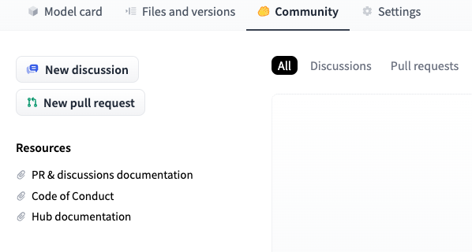
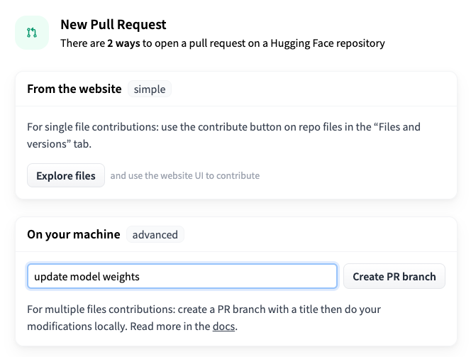

# Hugging Face Workflow Guide

## Hugging Face Pull Requests With Local Edits
Hugging Face also has a pull request (PR) feature, though the process is a bit different from GitHub. 

As with GitHub, you can interact through the web browser or a command line interface (eg., terminal on Mac). However, instead of the `create new branch` option, there is a `create new pull request` option. It is still preferable to avoid committing everything directly to main. To make further changes to the particular PR created on the browser, one must first clone the repo:
```
git clone <repo-url> 
```
Then, navigate to that folder `cd <repo-name>`, and fetch the PR files:

```
git fetch origin refs/pr/<PR#>:pr/<PR#>
git checkout pr/<PR#>
```

You can then make your updates, add and commit them, then push those back to the remote. Note that the push is the one line that differs from GitHub and must be used each time:
```
git add <changed files>
git commit -m "<change"
git push origin pr/<PR#>:refs/pr/<PR#>
```

For more information on Hugging Face Pull Requests and Discussions, see their [documentation](https://huggingface.co/docs/hub/repositories-pull-requests-discussions).

## Contribute as an Imageomics member with write access

The workflow on Hugging Face repositories should closely mirror that of GitHub repos (described in detail in the [Github Workflow](The-GitHub-Workflow.md)). However, Hugging Face repos function a little differently from GitHub’s, so we will review the details relevant to those differences and refer back to the [GitHub directions](The-GitHub-Workflow.md) where necessary.

Firstly, when making changes it is still best not to work on the main branch, but instead go through the pull request (PR) process. This process is a bit different on Hugging Face, as this is not their focus. Instead of initializing a new branch, we initialize a new PR. There are two ways of doing this, but both rely on the UI (web interface). 

1. Make your change directly on the UI (upload a file, edit the dataset/model card, etc), BUT select “Open as a pull request to the `main` branch” and write a descriptive commit message of your changes before pressing `commit`.

2. Navigate to the “Community” tab, and click “New pull request”

| Community tab with New pull request button | New Pull Request Interface |
| --- | --- |
| {  loading=lazy, width=400 } | {  loading=lazy, width=400 } |

!!! note "Their instructions for “from the website” are out of date."
    You actually select “Add file”, choose upload or create file, and you can upload any number of files (that are reasonable to include in a single commit) in a single commit, just select “Open as a pull request to the `main` branch”, as described in #1.

Now, to continue with the local branch method (if you intend to make multiple commits), give your PR an informative title and select “Create PR branch”. This will take you to a new page with instructions on how to connect locally to the PR and send your updates back to the repo. If the repo is private, you will need to ensure your credentials are set before cloning/fetching.

{ loading=lazy }
/// caption
///

Once you have made all of your changes, it is time to publish your branch. This is similar to initializing the PR on GitHub, in that you should:

 - Provide a detailed description of what your PR does
 - Tag one or two other people on the project to review it (`@hf-username please review`)
From here, reviewers can add their comments and suggestions on your PR (Note: to see the files in the PR, click on the last commit, then select “Browse files”)

Now, if there are changes to be made based on reviewer suggestions, files can be edited as usual (pushing to the PR branch). Alternatively, if you are working from the web interface and need to add files (or edit files of a supported type), then click on “from: refs/pr/#” just below the title of your PR to view the copy of the repo on the PR branch (like looking at a different branch on GitHub). Files can be added or edited here too.

{ loading=lazy }
